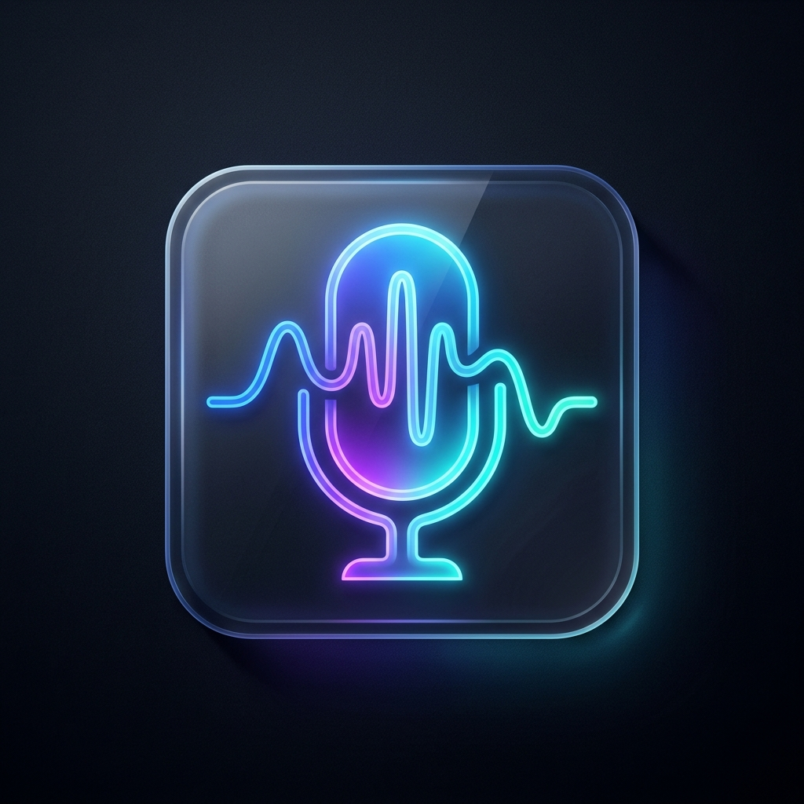

# VibeVoice Native (Standalone C# TTS)

  

## 日本語 (Japanese)

### 概要
VibeVoice Native は、Microsoft の VibeVoice モデルをベースにした、高性能でポータブルな Windows 11 ネイティブ TTS（音声合成）アプリケーションです。Python ランタイムを一切必要とせず、C# と ONNX Runtime のみで動作するように設計されています。

### 主な機能
- **ゼロショット・ボイスクローニング**: 5〜10秒の参照音声（WAV）を読み込むだけで、その話者の声を再現。
- **ボイスギャラリー**: お気に入りの参照音声をリスト管理し、簡単に切り替え可能。
- **自動モデルダウンロード**: 初回起動時に必要な ONNX モデルを自動的に取得。
- **ネイティブ Windows 11 UI**: WinUI 3 を採用したモダンで高速なユーザーインターフェース。
- **高効率な推論**: DirectML を介して GPU および CPU をフル活用し、低遅延での音声生成が可能。
- **保存機能**: 生成した音声を高品質な WAV ファイルとして保存。

### セットアップ
1. 本リポジトリをダウンロードまたはクローンします。
2. Visual Studio 2022 または `dotnet build` でビルドします。
3. 実行すると、必要なモデルのダウンロードが開始されます。

---

## English (English)

### Overview
VibeVoice Native is a high-performance, portable Windows 11 native TTS (Text-to-Speech) application based on Microsoft's VibeVoice model. It is designed to run purely on C# and ONNX Runtime, eliminating the need for a Python runtime.

### Key Features
- **Zero-shot Voice Cloning**: Reproduce any voice by simply loading a 5-10 second reference audio (WAV).
- **Voice Gallery**: Manage and switch between your favorite reference voices easily.
- **Auto Model Downloader**: Automatically retrieves the necessary ONNX models on the first run.
- **Native Windows 11 UI**: Modern and fast user interface built with WinUI 3.
- **Efficient Inference**: Leverages GPU and CPU via DirectML for low-latency audio generation.
- **Save Feature**: Save your generated speech as high-quality WAV files.

### Setup
1. Download or clone this repository.
2. Build with Visual Studio 2022 or `dotnet build`.
3. Upon running, the application will automatically download the required models.

## License & Disclaimer
This project is for research and personal use only. Please respect the "Responsible AI" guidelines and ethical considerations regarding voice cloning.
