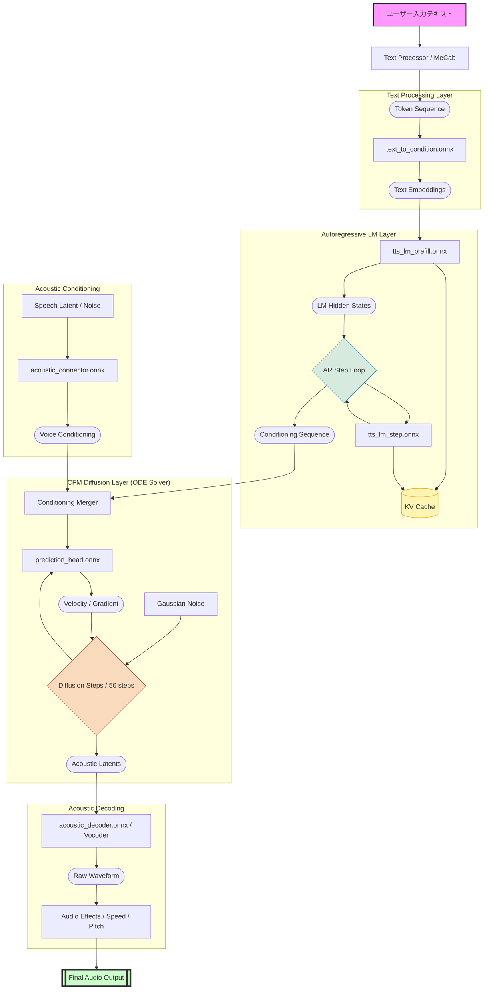
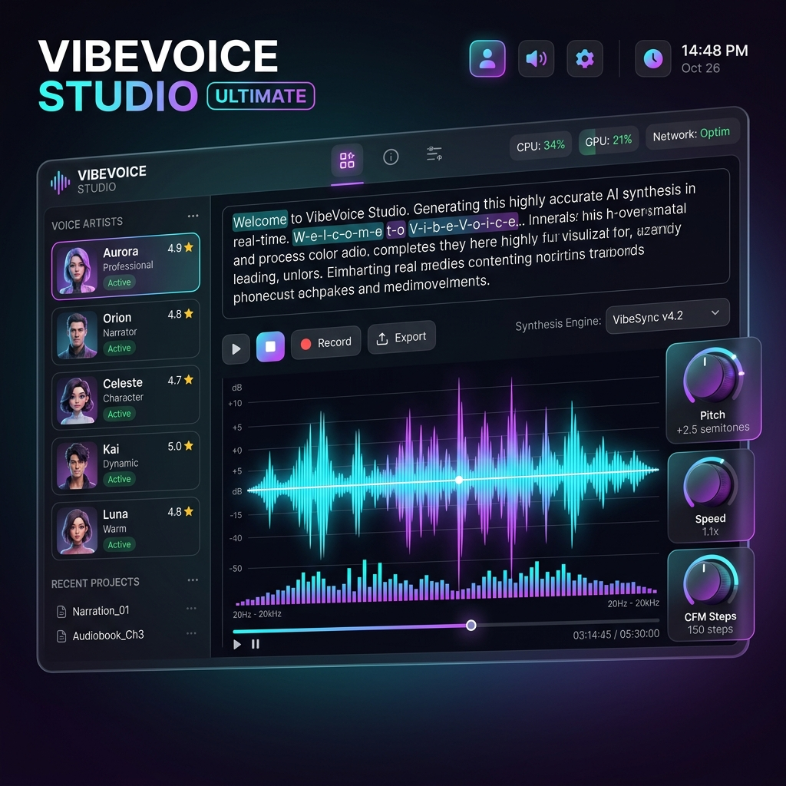

# VibeVoice Studio 推論パイプライン・アーキテクチャ & デザインコンセプト

`VibeVoicePipeline.cs` に実装されている、7つの ONNX モデルを組み合わせた高度な音声合成プロセスと、次世代 UI のビジョンをまとめたドキュメントです。

## 1. 推論パイプライン全体図 (Internal Architecture)

## 2. 次世代 UI デザインコンセプト (Ultimate Edition)

推論性能の向上に伴い、ユーザーインターフェースも「プレミアムかつ直感的」な体験を提供することを目指しています。

### デザインの柱
- **Rich Aesthetics**: ダークモードを基調とし、ネオンカラーのアクセントとグラスモフィズム（透かし効果）を多用。
- **Dynamic Feedback**: CFM 推論の状態をリアルタイムで波形化し、生成のプロセスを視覚的に楽しむことが可能。
- **State-of-the-art Design**: WinUI 3 のポテンシャルを最大限に引き出した、モダンなデスクトップアプリの理想形。

---

## 3. 実装上の注意 (Implementation Notes)
- **KV Cache**: `tts_lm_step.onnx` 実行時に過去の隠れ状態を保持することで、長い文章でも高速な推論を維持。
- **Regularization**: `Tanh` 関数によるスケーリングを各層の接続部に適用し、数値的な安定性を確保。

---
最終更新日: 2026年5月8日
